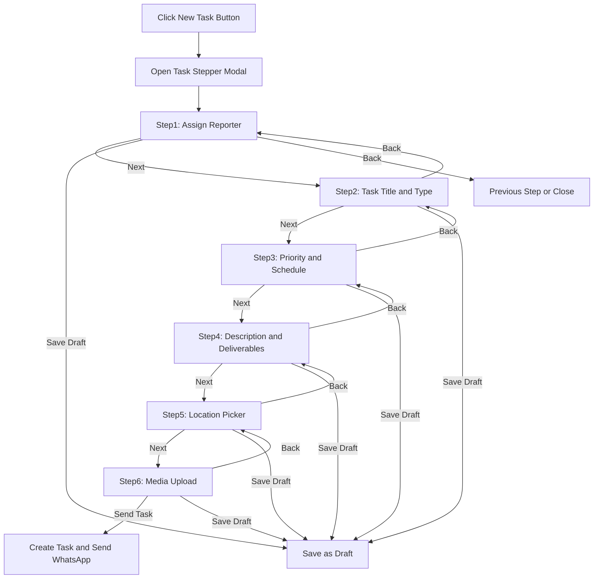
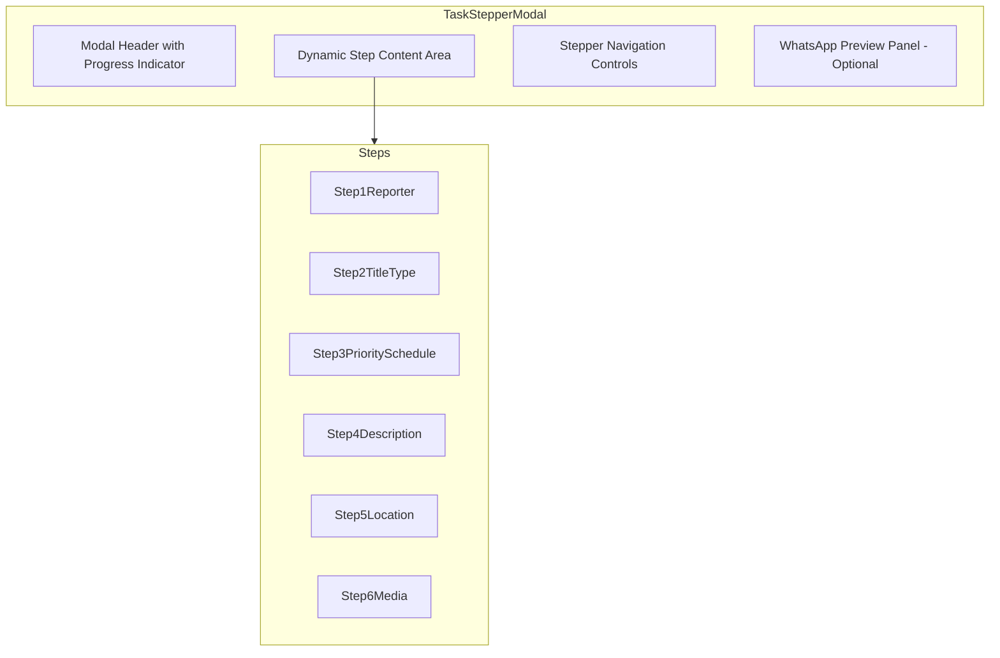

# Task Manager Stepper Modal - Architecture Plan

## Overview

Transform the existing single-form CreateTaskModal into a professional 6-step stepper wizard for creating tasks. This will provide a more organized and guided experience for admins when creating new tasks.

## Current State Analysis

The existing [`CreateTaskModal.tsx`](app/dashboard/tasks/components/CreateTaskModal.tsx) uses a3-column layout:
- Left: Define Task form fields
- Middle: Assign Reporter selection
- Right: WhatsApp Message Preview

## Proposed Architecture

### Stepper Flow Diagram



### Component Architecture



## Step Details

### Step1: Assign Reporter
**Mandatory**: Yes

**Features:**
- Search input to filter reporters by name, role, or skills
- List of active employees with availability status
- Single selection with visual confirmation
- Display reporter skills as tags
- Show performance score if available

**Validation:**
- Must select at least one reporter to proceed

**UI Elements:**
- Search bar with icon
- Employee cards with avatar, name, role, department
- Online/offline/busy status indicators
- Selection checkmark overlay

### Step2: Task Title and Task Type
**Mandatory**: Yes

**Features:**
- Task title text input
- Task type dropdown/select with icons
- Template selector to pre-fill form

**Task Types:**
- Breaking News
- Press Conference
- Interview
- Photo Assignment
- Video Assignment
- Fact Check
- Follow-Up
- Custom

**Validation:**
- Task title is required (min 5 characters)
- Task type must be selected

### Step3: Priority Level and Task Schedule
**Mandatory**: Yes

**Features:**
- Priority selection with visual indicators:
  - Urgent - Red
  - High - Orange
  - Normal - Green
  - Low - Blue
- Date picker for deadline
- Time range inputs - start time and end time

**Validation:**
- Priority must be selected
- Date is required
- Time range is required

### Step4: Detailed Description and Required Deliverables
**Mandatory**: Yes

**Features:**
- Rich text area for description
- Deliverables editor with quantity controls
- Add/remove deliverable items

**Deliverable Types:**
- Articles
- Photos
- Videos
- Interviews
- Fact Checks

**Validation:**
- Description is required (min 20 characters)

### Step5: Location Picker
**Mandatory**: Yes

**Features:**
- OpenStreetMap integration using react-leaflet
- Centered on Bahrain country view
- Click-to-pin functionality
- Draggable marker
- Address display based on coordinates
- Search by location name

**Map Configuration:**
- Default center: Bahrain coordinates - approximately 26.0667, 50.5577
- Default zoom: 10 - country level view
- Map provider: OpenStreetMap tiles

**Validation:**
- Location must be pinned on map

### Step6: Media Upload
**Mandatory**: No - Optional step

**Features:**
- Drag and drop upload zone
- File type filtering - images and documents only
- Multiple file selection
- File size validation - max5MB per file
- Preview thumbnails for images
- File list with remove option
- Upload progress indicators

**Supported File Types:**
- Images: JPG, PNG, GIF, WEBP
- Documents: PDF, DOC, DOCX

**Validation:**
- File size must be under5MB
- Only allowed file types accepted

## State Management

### TaskFormData Interface

```typescript
interface TaskFormData {
  // Step1
  assignee_id: string | null;
  
  // Step2
  title: string;
  taskType: TaskType;
  templateId?: string;
  
  // Step3
  priority: Priority;
  deadlineDate: string;
  startTime: string;
  endTime: string;
  
  // Step4
  description: string;
  deliverables: Record<string, number>;
  
  // Step5
  location: {
    lat: number;
    lng: number;
    address?: string;
  } | null;
  
  // Step6
  mediaFiles: File[];
}
```

### Stepper State

```typescript
interface StepperState {
  currentStep: number; // 1-6
  completedSteps: Set<number>;
  formData: TaskFormData;
  isSubmitting: boolean;
  errors: Record<string, string>;
}
```

## UI/UX Specifications

### Progress Indicator
- Horizontal stepper at the top
- Shows all6 steps with numbers
- Completed steps show checkmark
- Current step highlighted
- Allow clicking on completed steps to go back

### Navigation Buttons
- Back button - disabled on step1
- Next button - validates current step
- Save Draft button - available on all steps
- Send Task button - only on final step

### Validation Feedback
- Inline error messages below fields
- Red border on invalid inputs
- Toast notifications for save actions
- Disable Next button until step is valid

### Responsive Design
- Full-screen modal on mobile
- Side panel for WhatsApp preview on desktop
- Collapsible preview on tablet

## File Structure

```
app/dashboard/tasks/components/
├── CreateTaskModal.tsx          # Main modal wrapper - updated
├── stepper/
│   ├── TaskStepperModal.tsx     # Main stepper orchestrator
│   ├── StepperHeader.tsx        # Progress indicator
│   ├── StepperNavigation.tsx    # Back/Next/Draft/Send buttons
│   ├── steps/
│   │   ├── Step1Reporter.tsx    # Assign reporter step
│   │   ├── Step2TitleType.tsx   # Title and type step
│   │   ├── Step3PrioritySchedule.tsx # Priority and schedule step
│   │   ├── Step4Description.tsx # Description and deliverables step
│   │   ├── Step5Location.tsx    # Map location picker step
│   │   └── Step6Media.tsx       # Media upload step
│   └── hooks/
│       ├── useTaskForm.ts       # Form state management
│       └── useStepValidation.ts # Step validation logic
└── DeliverablesEditor.tsx       # Existing - reuse
```

## Implementation Notes

### Map Integration
The project already has `leaflet` and `react-leaflet` installed. Use these for the location picker:
- `MapContainer` from react-leaflet
- `TileLayer` with OpenStreetMap
- `Marker` with `useDraggable` for pin placement
- `useMapEvents` for click-to-pin functionality

### File Upload
Create a new media uploader component specifically for this stepper:
- Different from the existing [`FileUploader.tsx`](components/shared/FileUploader.tsx) which handles CSV/Excel
- Support multiple file types
- Show previews for images
- Validate file sizes client-side

### Draft Saving
Store draft in Firestore with status DRAFT:
- Can be resumed from tasks list
- Show draft indicator in UI
- Auto-save on step navigation - optional enhancement

## Dependencies

All required dependencies are already installed:
- `leaflet` - Map rendering
- `react-leaflet` - React components for Leaflet
- `@types/leaflet` - TypeScript types
- `firebase` - For storage uploads and Firestore

## Testing Checklist

- [ ] Step navigation works correctly
- [ ] Form data persists when navigating between steps
- [ ] Validation prevents progression on mandatory steps
- [ ] Map loads and pins correctly in Bahrain
- [ ] File upload validates size and type
- [ ] Draft can be saved at any step
- [ ] Final submission creates task correctly
- [ ] WhatsApp preview updates in real-time
- [ ] Modal closes after successful submission
- [ ] Error handling for network failures
